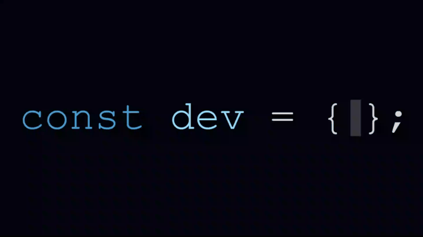

<p align="center">
  
</p>

---

### 👨‍💻 About Me

```js
if (wantToRead) {
  const dev = {
    name: "Eduard-Ciprian Apatachioae",
    alias: "EduZu",
    role: "FullStack Web Developer in training",
    stack: ["HTML", "CSS", "JavaScript", "Vue.js", "React", "Angular", "Node.js", "PHP", "Java"],
    tools: ["Bootstrap", "MySQL", "Git", "GitHub", "VS Code", "IntelliJ"],
    currentlyLearning: ["ServiceNow", "WordPress"],
    goals: "Finish DAW, grow as developer and join a strong dev team 🚀"
  };
  console.log(dev);
}
```

---

### 🧐 Technologies I'm working on & learning

```js
let myTechnologies = [
  "JavaScript", "Angular", "React", "Vue.js", "TypeScript", "Node.js",
  "Express", "PHP", "Java", "JUnit", "Tomcat", "MySQL",
  "Docker", "Bootstrap", "HTML5", "CSS3", "GitHub"
];
```

<p align="center">
  
  
  
  
  
  
  
  
  
  
  
  
  
  
  
  
  
</p>

---

### 📂 Projects
```js
const projects = [
  {
    name: "EntreCañas",
    description: "An online fishing store focused on product sales. Developed with HTML, JavaScript, and Bootstrap for the frontend, and Node.js for backend data handling with MySQL integration."
  },
  {
    name: "Gestión Hotelera",
    description: "Web app for hotel management (React + Node.js + MySQL)."
  }
];
```

---

### ✉️ Contact
```js
const contact = {
  github: "https://github.com/EduZu32",
  message: "Open an issue or pull request if you want to collaborate!"
};
```

---

<p align="center">
  <em>Made with <span style="color: #e25555;">♥</span> by EduZu</em>
</p>


