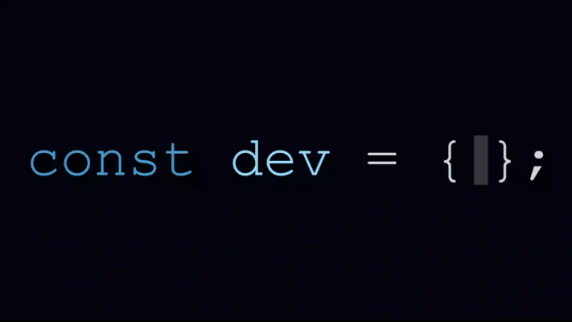

<p align="center">
  🚀 <b>Welcome to my GitHub!</b><br>
  Full-Stack Developer with experience in web development, REST APIs, and IT support.<br>
  Passionate about enterprise platforms, process automation, and AI-driven solutions.
</p>

---

<p align="center">
  
</p>

---

### 👨‍💻 About Me

👋 Hi, I'm **Eduard** (EduZu) — a **Full-Stack Developer** with experience in web development, JavaScript, REST APIs, and IT support.

I am focused on evolving toward **enterprise platforms**, **process automation**, and **AI-powered solutions**, while expanding my knowledge in cloud technologies and IT service management.

```js
if (wantToRead) {
  const dev = {
    name: "Eduard",
    alias: "EduZu",
    role: "Full-Stack Developer | ServiceNow Developer in training",
    focus: "Enterprise solutions, process automation & AI integration",
    currentlyLearning: [
      "ServiceNow Platform (CSA Certification path)",
      "Cloud technologies",
      "Advanced AI & LLM integration"
    ],
    goal: "Grow as a Technical Consultant in ServiceNow and enterprise environments"
  };
  console.log(dev);
}


```
---

### 📜 Certifications

```js
const certifications = [
  "Agile & Scrum - Advanced (Universidad Europea Online)",
  "Project Portfolio Management - Advanced (Universidad Europea Online)",
  "Micro-Certification - Welcome to ServiceNow (ServiceNow, May 2025)",
  "Google: Inteligencia Artificial y Productividad (Google, Jul 2024)",
  "Master en JavaScript: Aprender JS, jQuery, Angular, NodeJS (Udemy, Feb 2023)",
  "Bases de datos con MySQL y SQLite (Udemy, Feb 2023)",
  "ServiceNow Associate Application Developer (in progress, 62%)",
  "ServiceNow Skills Earned: Now Platform, AI, Generative AI, Knowledge Management, Platform Analytics, Service Catalog, Workflow Studio"
];
console.log(certifications);
```

---

### 🧐 Technologies I'm working on & learning

```js
let technologies = [
  // Languages & Frameworks
  "JavaScript (ES6+)", "TypeScript", "React", "Angular", "Node.js", 
  "PHP", "Java", "HTML5", "CSS3",
  
  // APIs & Services
  "REST APIs", "JSON", "Web Services",
  
  // Databases
  "SQL / MySQL", "MongoDB",
  
  // Platforms
  "ServiceNow (CSA Preparation, ITSM)",
  
  // Tools & Others
  "Docker", "Git", "GitHub", "VS Code",
  
  // Artificial Intelligence
  "Ollama", "LM Studio", "Local LLMs", "AI Process Automation"
];
console.log(technologies);
```

<p align="center">
  
  
  
  
  
  
  
  
  
  
  
  
  
  
  
  
  
  
</p>


---

### 📂 Projects
```js
const projects = [
  {
    name: "Hotel Management Fullstack App",
    description: "Fullstack web application (React + Bootstrap + Node.js + Express + MySQL). Features REST API, JWT authentication, role-based access control, hotel operations management. [View project](https://github.com/EduZu32/hotel-management-fullstack-app)"
  },
  {
    name: "EdyCasa - Real Estate Management App",
    description: "Fullstack web application (PHP + MySQL + HTML + CSS + JS). Features user roles (Admin, Seller, Buyer), property management (CRUD), authentication, and responsive UI. [View project](https://github.com/EduZu32/edycasa-real-estate-app)"
  },
  {
    name: "Pokémon SPA (React App)",
    description: "Single Page Application (SPA) built with React + Vite + Context API. Features API integration with PokeAPI, dynamic UI, state management for favorites, and responsive design. [View project](https://github.com/EduZu32/poke-spa)"
  },
  {
    name: "Car Race Simulation (Java Project)",
    description: "Console-based Java application simulating a car race. Features object-oriented design with classes for Cars and Race management. Includes race logic, car properties, and simple simulation flow. Built using pure Java (OOP) principles. [View project](https://github.com/EduZu32/car-race-java)"
  },
  {
  name: "Bingo Game (Java Project)",
  description: "Console-based Java Bingo game application. Features object-oriented design with classes for Game logic, Card generation, and Ball drawing simulation. Built using pure Java (OOP) principles. [View project](https://github.com/EduZu32/bingo-game)"
  },
  {
    name: "Library Catalog Management (Java Project)",
    description: "Console-based Java application to manage a library catalog. Implements object-oriented design with classes for catalog types, exception handling, and controller logic. Features book management (add, remove, list), catalog type differentiation, and custom exception handling. Built using pure Java (OOP). [View project](https://github.com/EduZu32/java-library-catalog)"
  },
  {
    name: "Tech Event Management System",
    description: "Web application to manage tech events with user authentication (file-based), event CRUD with MySQL, responsive UI using Bootstrap, and error logging system. Built with PHP and Vanilla JS. [View project](https://github.com/EduZu32/tech-event)"
  },
  {
    name: "TiendaPesca - E-Commerce Web App",
    description: "Fullstack E-Commerce web application with responsive product catalog, shopping cart functionality, and REST API (Node.js + Express + MySQL). Features JWT-based authentication, Swagger API docs, and modern UI with Vanilla JS. [View project](https://github.com/EduZu32/TiendaPesca)"
  }
];
console.log(projects);

```

---

### ✉️ Contact
```js
const contact = {
  github: "https://github.com/EduZu32",
  linkedin: "https://www.linkedin.com/in/eduard-ciprian-a-3745ab238/",
  message: "Open an issue or pull request if you want to collaborate!"
};
console.log(contact);

```

---

<p align="center">
  <em>Made with <span style="color: #e25555;">♥</span> by EduZu</em>
</p>


